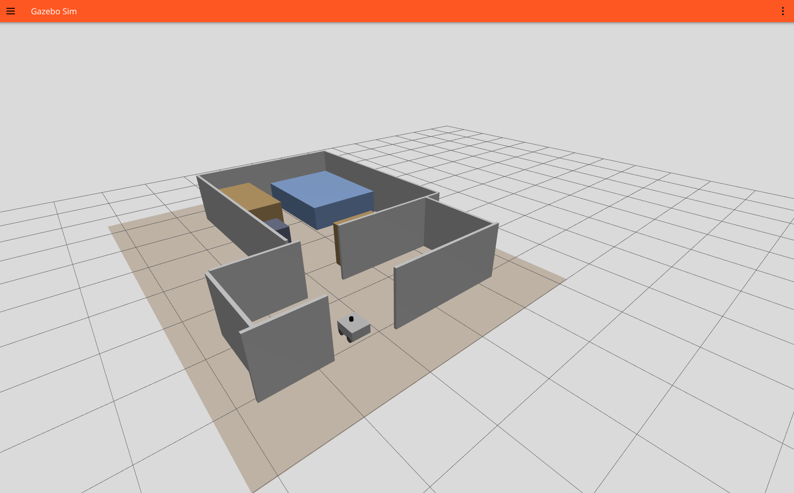
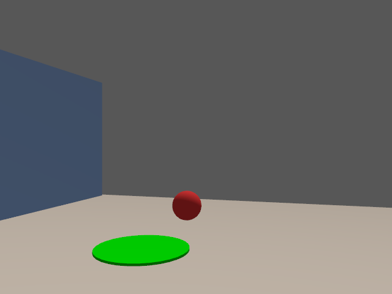
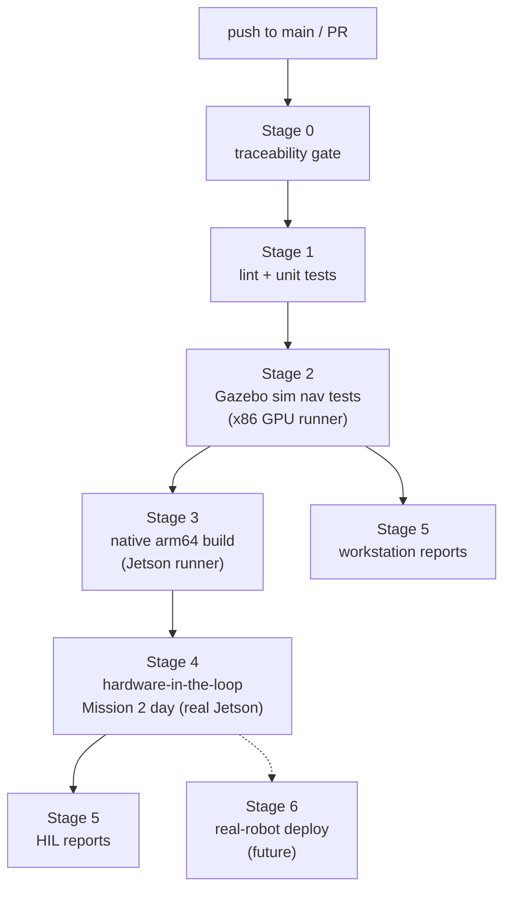
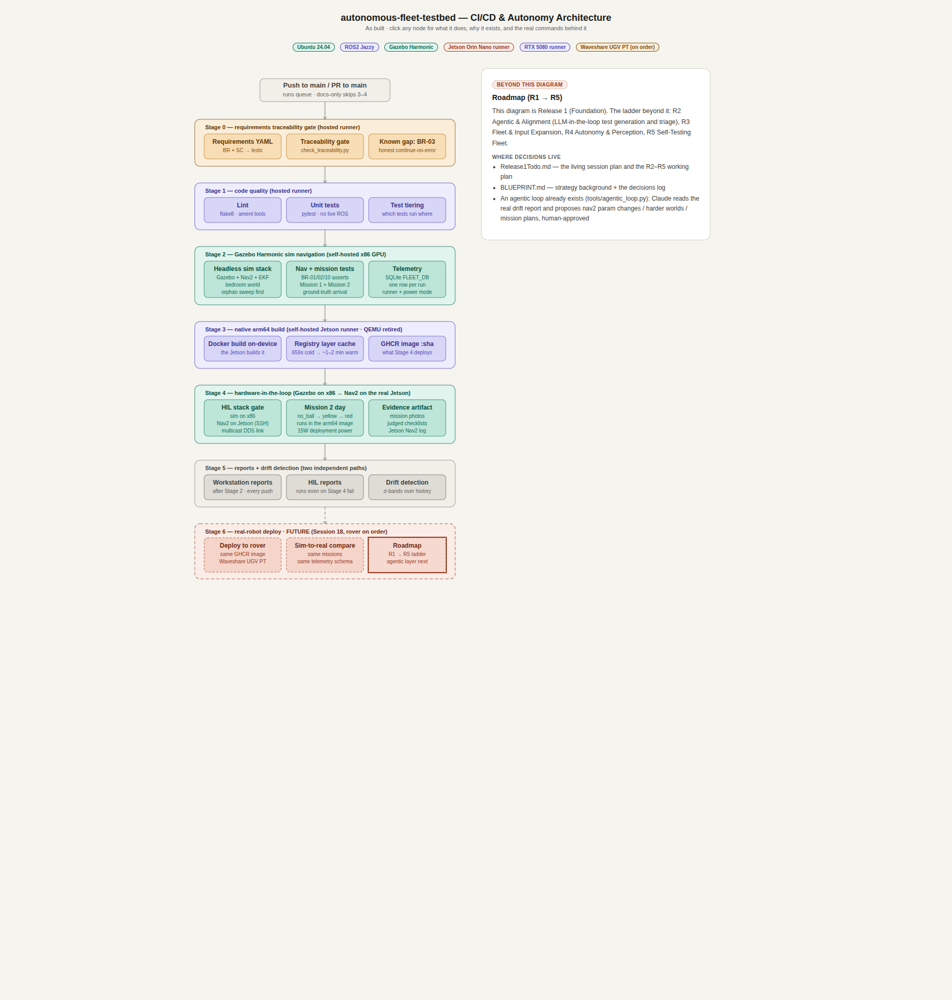

# autonomous-fleet-testbed


A CI/CD-native simulation testing framework for autonomous robots. Every push runs a
robot through requirements gates, simulated navigation missions in Gazebo, a native
arm64 build, and a hardware-in-the-loop stage on a real Jetson — with telemetry,
photo evidence, and statistical drift detection on the results. Sim-first: bugs are
flushed on a workstation in seconds, not on a robot in the field.

**Lineage:** this project is a ground-up rebuild of an earlier prototype
(`autonomous-nav-test-pipeline`) that proved the same navigate → detect → react
mission pattern using NVIDIA Isaac Sim 5.1 on Windows/WSL2. This version moves to a
fully Linux-native stack (Gazebo Harmonic + ROS2 Jazzy) with a real 6-stage CI/CD
pipeline and genuine hardware-in-the-loop testing on a Jetson Orin Nano — not just
simulation.

**Roadmap:** the next release adds more autonomy and perception, and introduces a
second robot for real multi-robot coordination testing.

**What's next:** the lessons from this project are seeding a follow-on effort
(working name `synthetic-fleet`) that drops the physical-hardware tether entirely to
explore large-scale synthetic fleet simulation and sim-to-real transfer — likely
returning to NVIDIA's Isaac Sim/Isaac Lab ecosystem, whose GPU-parallelized,
tensor-native training interface fits large-scale RL work in a way Gazebo doesn't.

| The simulated world (a real, measured bedroom) | What the robot saw (CI run, real Jetson) |
|---|---|
|  |  |

## Architecture





Every stage and node above is clickable in the full interactive version —
[`docs/architecture.html`](docs/architecture.html) *(open locally in a browser;
GitHub renders it as source, so the screenshot above is the fallback preview)*.

## Hardware-in-the-loop

This isn't a simulation-only demo. Every push to `main` runs Stage 4: Gazebo keeps
simulating the world on the x86 workstation, but Nav2 — localization, planning, and
control — runs on a real, physical Jetson Orin Nano, exchanging live ROS2/DDS traffic
over the network between two machines. The robot's camera-based ball-color detector
watches the feed and triggers real reactive navigation: photograph and return home on
yellow, photograph and stop on red. Every run captures photo evidence and telemetry
(SQLite), with statistical drift detection flagging any run that regresses against a
rolling baseline.

It's proven on every push, not a one-off recording — the CI badge at the top reflects
a pipeline that runs against a real robot, not a mock.

**Want to build the hardware tier yourself?**
- **Flash, provision, and register a Jetson Orin Nano** —
  [`docs/runbooks/JetsonInstallSession14.md`](docs/runbooks/JetsonInstallSession14.md)
- **First real HIL run (manual procedure)** —
  [`docs/runbooks/Mission1HILSession15.md`](docs/runbooks/Mission1HILSession15.md)

## Quickstart (everything already installed)

From the repo root, in a terminal with the environment set up (see below):

```bash
colcon build --symlink-install          # ~1 s
source install/setup.bash

# Unit tests (the live-ROS test files are excluded — they need the sim running)
python -m pytest tests/ -v \
  --ignore=tests/test_ros2_contracts.py --ignore=tests/test_navigation.py \
  --ignore=tests/test_mission_run.py --ignore=tests/test_mission2.py \
  --ignore=tests/test_nav_runner.py

# Launch the sim (Gazebo headless + Nav2). Wait for "Managed nodes are active".
ros2 launch src/nav_fleet/launch/sim_launch.py

# In a second terminal: run Mission 1 (navigate → photograph → return)
python -m nav_fleet.mission_runner mission1
# → per-waypoint checklist prints; the photo lands in reports/photos/

# Telemetry dashboard
streamlit run dashboard/app.py
```

To watch the sim, open the viewer alongside the headless server: `gz sim -g`.
(Viewer navigation cheatsheet: [`GazeboCommands.md`](GazeboCommands.md).)

## Setup from scratch (one Ubuntu machine, no robot needed)

The entire sim pipeline runs on a single Ubuntu workstation. The Jetson/HIL tier is
optional extra hardware — see "Hardware-in-the-loop" above.

1. **Ubuntu 24.04** (bare metal recommended; the sim renders headless without a GPU,
   a discrete GPU just makes it faster).
2. **ROS2 Jazzy** — follow the
   [official install guide](https://docs.ros.org/en/jazzy/Installation/Ubuntu-Install-Debs.html),
   then the packages this project needs:
   ```bash
   sudo apt install ros-jazzy-desktop ros-jazzy-ros-gz \
     ros-jazzy-navigation2 ros-jazzy-nav2-bringup \
     ros-jazzy-rmw-cyclonedds-cpp ros-jazzy-robot-localization \
     ros-jazzy-vision-msgs python3-colcon-common-extensions
   ```
   *You should see:* `gz sim --version` reports Gazebo Harmonic.
3. **Python environment**:
   ```bash
   python3 -m venv ~/fleet-env && source ~/fleet-env/bin/activate
   pip install -r requirements-ci.txt
   ```
   (`requirements-ci.txt` is the curated dependency set; `requirements.txt` is a full
   local freeze — don't install that one.)
4. **Environment** — add to `~/.bashrc` or run per terminal:
   ```bash
   source /opt/ros/jazzy/setup.bash
   export RMW_IMPLEMENTATION=rmw_cyclonedds_cpp
   export ROS_LOCALHOST_ONLY=1   # single-machine setup: keep DDS on loopback
   ```
   *(All processes must agree on `ROS_LOCALHOST_ONLY` — set it everywhere or nowhere.
   Remove it if you later add a second machine.)*
5. **Clone, build, verify**:
   ```bash
   git clone https://github.com/sdfinn/autonomous-fleet-testbed.git
   cd autonomous-fleet-testbed
   colcon build --symlink-install && source install/setup.bash
   python -m pytest tests/ -v --ignore=tests/test_ros2_contracts.py \
     --ignore=tests/test_navigation.py --ignore=tests/test_mission_run.py \
     --ignore=tests/test_mission2.py --ignore=tests/test_nav_runner.py
   ```
   *You should see:* the build finishes in ~1 s and all unit tests pass.
6. **First mission** — run the Quickstart above. *You should see:* Nav2 reach
   "Managed nodes are active", the mission print a five-step checklist ending in
   `Mission mission1: PASS`, and a photo of the simulated bedroom in `reports/photos/`.

## What the CI expects

The full pipeline assumes two self-hosted runners: an x86 workstation with a GPU
(labels `self-hosted, x86, gpu, rtx5080`) for the sim stages, and a Jetson Orin Nano
(`self-hosted`, arm64) for the native build — plus the Jetson being reachable over
SSH for the HIL stage. **Stages 0–1 run on GitHub-hosted runners**, so a fork gets
the requirements gate and quality gate working with zero setup; stages 2–5 need the
hardware. Runs are serialized via a concurrency group because the runners are
physical, shared machines.

## Repo map

| Path | What it is |
|---|---|
| `src/nav_fleet/` | ROS2 package: launch files, URDF, worlds, Nav2 config, mission runner, ball detector |
| `tools/` | CLI utilities: traceability gate, telemetry, drift detection, HIL day orchestrator, agentic loop |
| `tests/` | pytest suite — unit tier plus live sim/HIL integration tiers |
| `requirements/` | Requirement specs + traceability matrix (`traceability.yaml`) |
| `config/` | Drift thresholds (`drift_config.yaml`) — thresholds are data, never code |
| `robot_profiles/` | Per-robot capability YAML (drives requirement skips) |
| `dashboard/` | Streamlit telemetry dashboard |
| `scripts/` | `hil_stage.sh` — the whole HIL stage, runnable locally or from CI |
| `reports/` | Generated reports, mission photos (telemetry DB lives at `~/fleet-ci-data/fleet_runs.db` — see CLAUDE.md) |
| `.github/workflows/ci.yml` | The 6-stage pipeline (see architecture above) |
